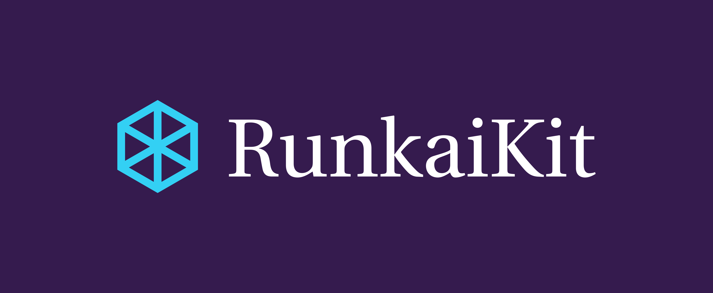

# RunkaiKit

RunkaiKit allows developers to gain access to a lot of useful tools for Swift. 

List of features:
- General iOS API calls
- Rift (A work in progress Swift based programming language)
- RMath - a math library containing functions that performs Algebra and Calculus operations.
